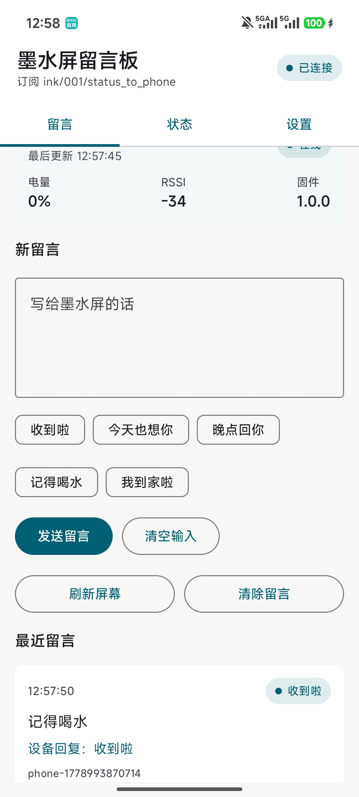

# InkMessageBoard 墨水屏留言板

中文 | [English](README.en.md)

> 这是一个个人学习和交流用的开源原型项目，欢迎参考、复现和继续改进。它不是成熟商业产品，不保证商用稳定性，也不建议未经验证直接量产。

InkMessageBoard 是一个基于 **ESP32-S3、墨水屏、MQTT 和 Android App** 的留言板原型项目。核心流程是：Android App 输入留言，通过 MQTT 发布消息；ESP32-S3 连接 Wi-Fi 和 MQTT Broker，收到留言后刷新墨水屏；设备也可以上报在线状态、电量、RSSI、固件版本和留言处理状态。


## 项目图片

| 设备正面 | 设备侧面 |
| --- | --- |
|  |  |

| App 界面 | 系统架构 |
| --- | --- |
|  |  |


## 已跑通的流程

1. Android App 输入留言。
2. App 通过 MQTT 发布消息。
3. ESP32-S3 连接 Wi-Fi 和 MQTT Broker。
4. ESP32-S3 订阅留言 Topic 和命令 Topic。
5. ESP32-S3 收到留言后刷新墨水屏。
6. 设备可以通过触摸按键回传简单状态。
7. App 可以看到设备上报的在线、电量、RSSI、固件版本等信息。

MQTT 测试时使用过 EMQX Cloud。仓库里不包含真实 Broker 地址、用户名和密码，复现时请填写自己的测试账号。

## 项目定位

这个仓库主要是学习记录和交流资料，不是成熟产品。它适合用来学习：

- ESP32-S3 + Arduino/PlatformIO 工程组织
- Wi-Fi、MQTT、TLS 连接和重连
- 墨水屏刷新和中文点阵字体显示
- Android Compose 简单界面
- Android 与嵌入式设备之间的 MQTT 交互
- 原理图、PCB、Gerber、BOM 等开源硬件资料整理

目前仍然不完善：

- 没有做成稳定商品
- 没有完整安全设计
- 没有完整生产测试流程
- Android 和固件代码还有继续整理空间
- 文档中的参数、调试经验和复现细节仍可继续补充

## 仓库结构

```text
InkMessageBoard/
├── android/              # Android App 工程
├── firmware/esp32/       # ESP32-S3 PlatformIO 固件工程
├── hardware/             # 三块板子的源工程、原理图、PCB 图、Gerber、BOM
├── docs/                 # 构建、协议、软硬件说明
└── media/                # 视频脚本和演示素材
```

## 文档入口

- [软件介绍](docs/software_overview.md)
- [硬件介绍](docs/hardware_overview.md)
- [MQTT 协议](docs/mqtt_protocol.md)
- [ESP32 固件编译](docs/build_firmware.md)
- [Android App 编译](docs/build_android.md)
- [硬件连接](docs/hardware_connection.md)
- [已知问题](docs/known_issues.md)

## 开源内容

当前仓库包含：

- ESP32-S3 固件源码和 PlatformIO 配置
- Android App 源码和 Gradle 配置
- 三块板子的硬件源工程
- 原理图 PDF
- PCB 正反面图片
- Gerber 压缩包
- BOM 和贴片坐标文件
- 设备照片、流程图和 App 展示图

## 隐私和凭据

公开发布前已经处理：

- 删除 Android `local.properties`
- 删除 Android/ESP32 构建缓存
- 删除固件工程里嵌套的 `.git`
- 移除真实 EMQX Cloud Host、用户名和密码
- 示例配置使用占位符

你自己 fork 或二次发布前，也请再检查一次 Wi-Fi、MQTT、截图、串口日志和图片背景里是否有私人信息。

## 许可证

当前仓库的软件代码、文档、图片资料和硬件设计文件默认都使用 MIT License，见 [LICENSE](LICENSE)。

硬件部分同样按 MIT License 开放，方便大家学习、修改、制造和继续完善。打板和使用前请自行核对原理图、PCB、BOM、Gerber 和装配方式。
