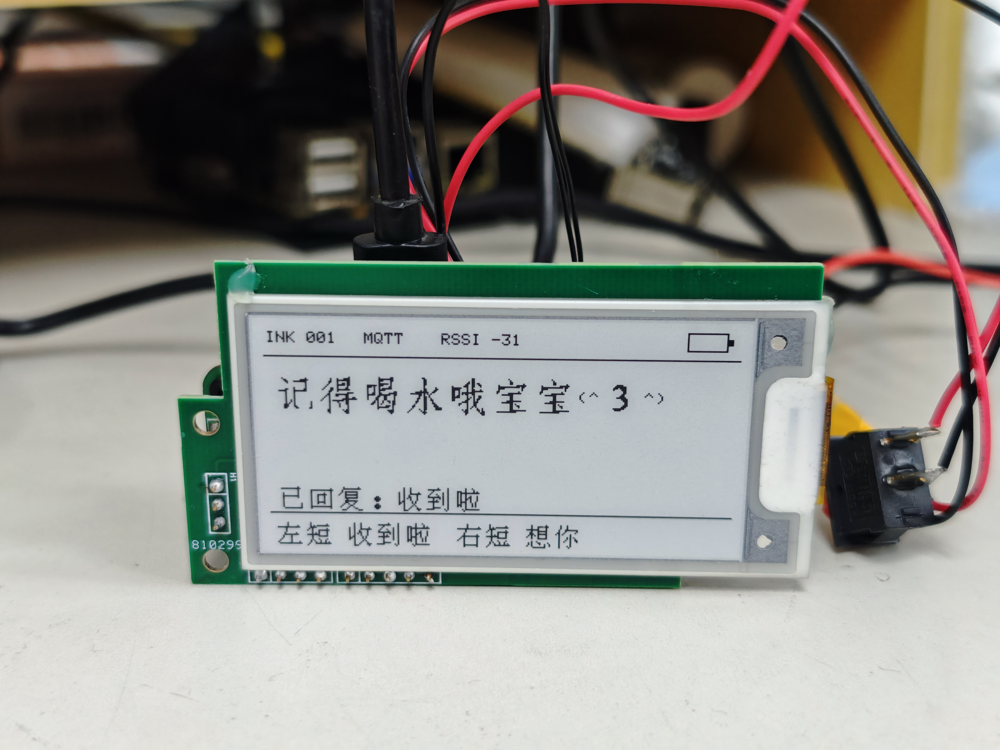
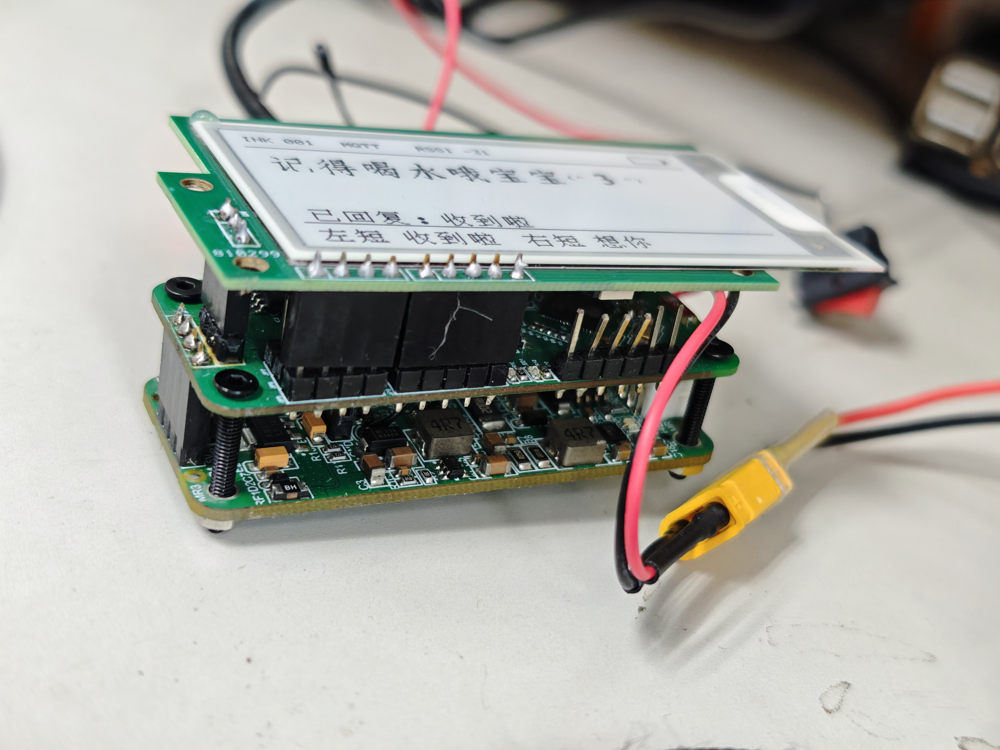
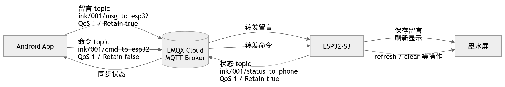
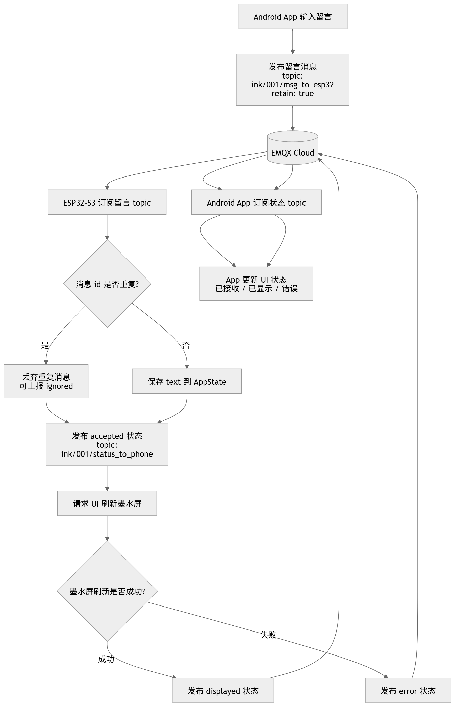

# InkMessageBoard 墨水屏留言板

> 说明：这是一个个人学习和交流用的原型项目，欢迎参考、讨论和继续改进；它不是成熟商业产品，也不保证商用稳定性。

这是一个 **ESP32-S3 + 墨水屏 + MQTT + Android App 的留言板原型项目**。

这个仓库主要是学习记录和交流资料，不是成熟产品，也不保证拿来就能稳定量产。它目前的价值更像是：把一个已经跑通核心流程的 IoT 小作品完整分享出来，方便后来的人参考、复现、改进，或者作为嵌入式/Android/开源硬件作品集的一个例子。



## 项目图片

| 实物正面 | 设备侧面 |
| --- | --- |
|  |  |

## 系统流程图





## 现在能跑通的流程

1. Android App 输入留言。
2. App 通过 MQTT 发布消息。
3. ESP32-S3 连接 Wi-Fi 和 MQTT Broker。
4. ESP32-S3 收到留言后刷新墨水屏。
5. 设备可以通过左右触摸按键回复简单状态。
6. App 可以看到设备上报的在线、电量、RSSI、固件版本等信息。

MQTT 测试时用过免费的 EMQX Cloud。仓库里已经把真实 broker 地址、用户名和密码换成占位符，使用时请填写你自己的测试账号。

## 项目定位

这个项目适合用来学习：

- ESP32-S3 + Arduino/PlatformIO 工程组织
- Wi-Fi、MQTT、TLS 连接和重连
- 墨水屏刷新、中文点阵字体显示
- Android Compose 简单界面
- Android 与嵌入式设备的 MQTT 交互
- 原理图、PCB、Gerber、BOM 等开源硬件资料整理

它目前还不完善：

- 没有做成稳定商品
- 没有完整安全设计
- 没有完整生产测试流程
- 文档仍然需要继续补照片、参数和调试经验
- Android 和固件里还有不少可以整理的地方

如果你有时间、有兴趣，欢迎基于这个仓库继续完善。

## 仓库结构

```text
InkMessageBoard/
├── android/              # Android App 工程
├── firmware/esp32/       # ESP32-S3 PlatformIO 固件工程
├── hardware/             # 三块板子的源工程、原理图、PCB 图、Gerber、BOM
├── docs/                 # 构建、协议、软硬件说明
└── media/                # 视频脚本和演示素材
```

## 文档入口

- [软件介绍](docs/software_overview.md)
- [硬件介绍](docs/hardware_overview.md)
- [MQTT 协议](docs/mqtt_protocol.md)
- [ESP32 固件编译](docs/build_firmware.md)
- [Android App 编译](docs/build_android.md)
- [硬件连接](docs/hardware_connection.md)
- [已知问题](docs/known_issues.md)

## 开源内容

当前仓库包含：

- ESP32-S3 固件源码和 PlatformIO 配置
- Android App 源码和 Gradle 配置
- 三块板子的硬件源工程
- 原理图 PDF
- PCB 正反面图片
- Gerber 压缩包
- BOM 和贴片坐标文件
- 设备照片和 App 截图

## 隐私和凭据

发布前已经处理：

- 删除 Android `local.properties`
- 删除 Android/ESP32 构建缓存
- 删除固件工程里嵌套的 `.git`
- 移除真实 EMQX Cloud host、用户名和密码
- 没有把显示真实 broker 地址的 App 状态页截图放进文档图片

你自己 fork 或二次发布前，也请再检查一次 Wi-Fi、MQTT、截图、串口日志和图片背景里是否有私人信息。

## 许可证

当前仓库的软件代码、文档、图片资料和硬件设计文件默认都使用 MIT License，见 [LICENSE](LICENSE)。

硬件部分同样按 MIT License 开放，方便大家学习、修改、制造和继续完善。打板和使用前请自行核对原理图、PCB、BOM 和装配方式。
