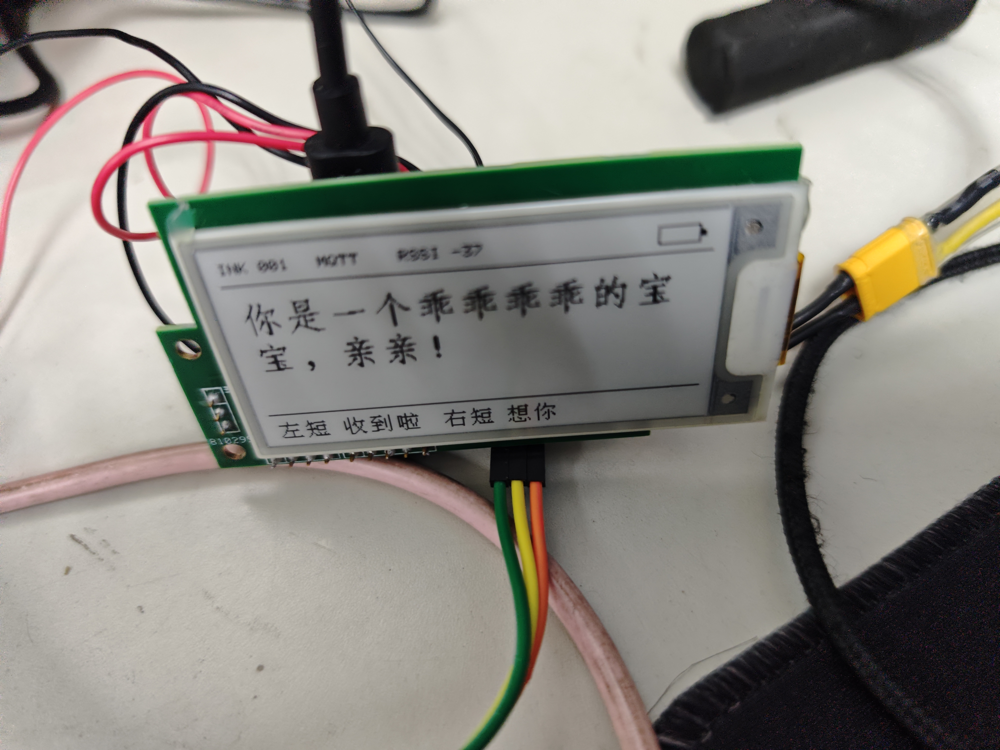
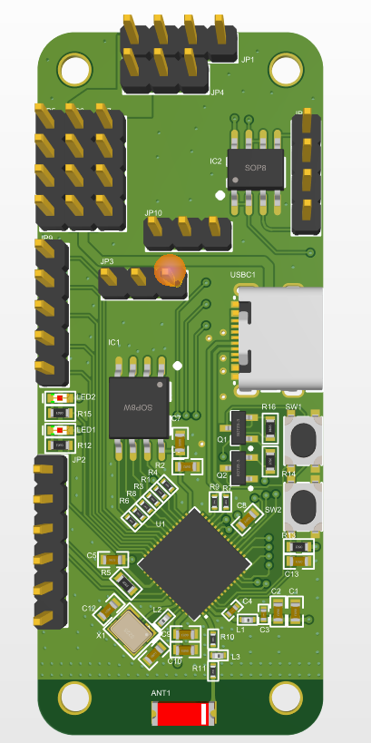
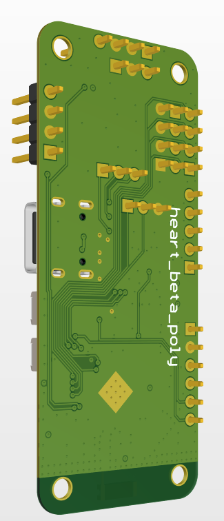
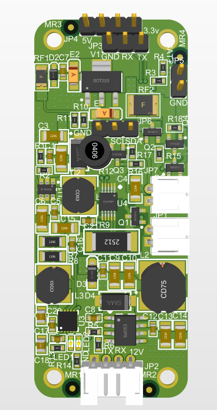
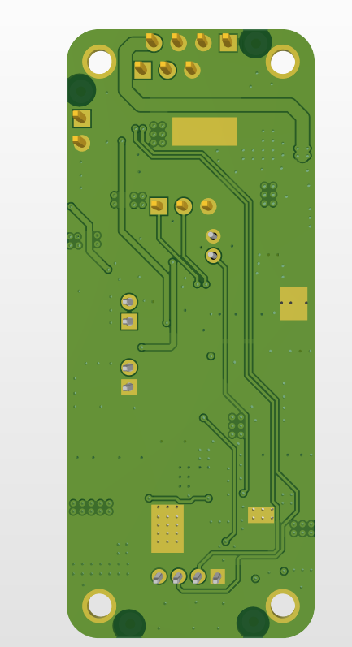
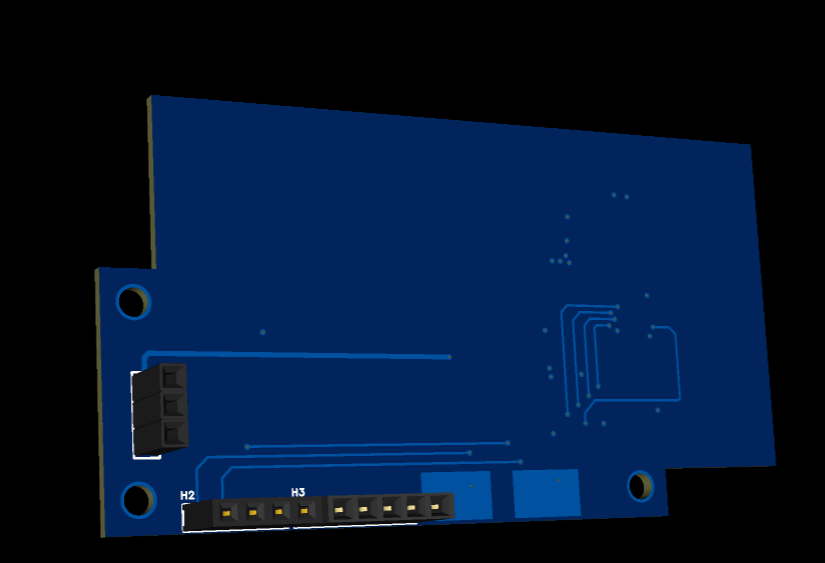
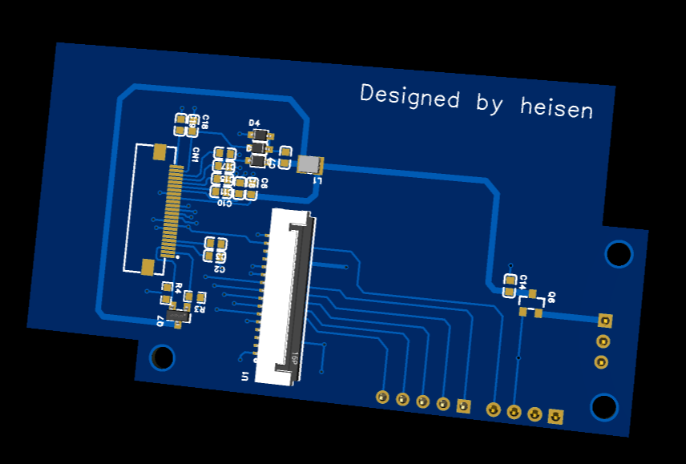

# 硬件介绍

这个项目的硬件部分目前包含三块板子的资料。它们都是学习和原型验证用途，不建议直接当成成熟量产资料使用。

硬件设计文件同样使用 MIT License 开放。你可以学习、修改、制造和分发，但实际打板、装配、供电和使用风险需要自行确认。

## 板子列表

| 板子 | 工程类型 | 说明 |
| --- | --- | --- |
| ESP32-S3 主控板 | Altium Designer | 主控、Wi-Fi/MQTT、墨水屏控制、触摸输入等 |
| 电源板 | Altium Designer | 供电相关电路 |
| 2.66 寸墨水屏板 | 嘉立创 EDA | 墨水屏连接/转接相关电路 |

## 开源资料位置

```text
hardware/
├── source/
│   ├── altium/
│   │   ├── esp32_s3_board/
│   │   └── power_board/
│   └── lceda/
│       └── ink_board/
├── schematic/
├── pcb/
├── gerber/
├── bom/
└── production/
```

## 已整理的文件

- AD 源工程：`hardware/source/altium/`
- 嘉立创 EDA 工程：`hardware/source/lceda/`
- 原理图 PDF：`hardware/schematic/`
- PCB 正反面图：`hardware/pcb/`
- Gerber 压缩包：`hardware/gerber/`
- BOM：`hardware/bom/`
- 贴片坐标：`hardware/production/`

## 实物和 PCB 图片




## PCB 图片

### ESP32-S3 主控板

| 正面 | 背面 |
| --- | --- |
|  |  |

### 电源板

| 正面 | 背面 |
| --- | --- |
|  |  |

### 2.66 寸墨水屏板

| 正面 | 背面 |
| --- | --- |
|  |  |

## 注意事项

- 硬件源文件是开源硬件最重要的部分，图片和 Gerber 不能完全替代源工程。
- 发布或打板前，请重新检查原理图、封装、BOM 和 Gerber 是否对应同一个版本。
- 如果你要基于这个项目改板，建议先从原理图和实际焊接照片一起核对。
- 电源、电池、充电、墨水屏排线方向这些地方需要特别小心。
